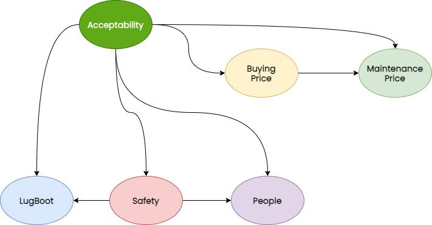

# BayesianCars

Provided with a dataset consisting of data about several cars, this research first tries to **infer a Bayesian Network** that accurately describes the problem and its probabilistic background, then, using the generated network, provides an analysis on the **interest generated by the car** for future saleability with respect to different features of the car. The inference is first computed withvariable elimination, then an approximation through **Rejection Sampling** and **Likelihood Weighting** is compared to the initial results.

### You can read the report [here](https://github.com/montali/BayesianCars/blob/main/Analysing_the_saleability_of_cars_through_BN.pdf) and check the code [here](https://github.com/montali/BayesianCars/blob/main/Cars%20Network.ipynb).

